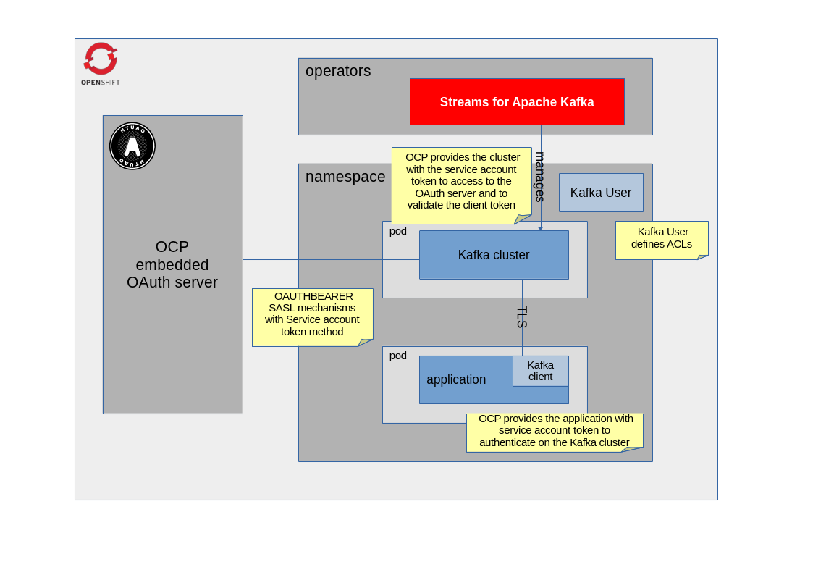

:ocp-project: kafka-oauth-ocp
:ocp-version: 4.18
:streams-version: 2.9
:kafka-cluster-name: example-kafka-cluster
:service-account-name: kafka-client-sa
== Camel Kafka - Spring Boot example

=== Abstract

An example which shows how to authenticate on a Kafka cluster using OpenShift OAuth server, using the custom resources managed by the Streams operator

=== Introduction

Since OpenShift has the OAuth embedded server, the scenario is based on how to integrate OCP OAuth server with Kafka cluster, configuring the listener to manage the OAuth mechanism using the embedded server and the OCP service accounts tokens. https://docs.redhat.com/en/documentation/openshift_container_platform/{ocp-version}/html/authentication_and_authorization/configuring-internal-oauth[Documentation]

== Trying out the example on OpenShift

=== Prerequisites

First, start with creating a new OpenShift project:

[subs="attributes"]
----
oc new-project {ocp-project}
----

Install operator `Streams for Apache Kafka` in the created namespace using OperatorHub https://docs.redhat.com/en/documentation/red_hat_streams_for_apache_kafka/{streams-version}/html/getting_started_with_streams_for_apache_kafka_on_openshift/proc-deploying-cluster-operator-hub-str#proc-deploying-cluster-operator-hub-str[Documentation]

=== Deploy Kafka cluster

Deploy the kafka cluster with OAuth2 configuration using https://docs.redhat.com/en/documentation/red_hat_streams_for_apache_kafka/{streams-version}/html/deploying_and_managing_streams_for_apache_kafka_on_openshift/assembly-oauth-security-str#con-oauth-authentication-broker-str[OCP API server as authorization server] and https://docs.redhat.com/en/documentation/red_hat_streams_for_apache_kafka/{streams-version}/html/deploying_and_managing_streams_for_apache_kafka_on_openshift/assembly-kraft-mode-str#assembly-kraft-mode-str[KRaft]

[subs="attributes",source,shell]
```
cat << EOF | oc apply -f -
apiVersion: kafka.strimzi.io/v1beta2
kind: KafkaNodePool
metadata:
  name: multirole
  labels:
    strimzi.io/cluster: {kafka-cluster-name}
  namespace: {ocp-project}
spec:
  roles:
    - controller
    - broker
  storage:
    type: ephemeral
    kraftMetadata: shared
  replicas: 1
---
apiVersion: kafka.strimzi.io/v1beta2
kind: Kafka
metadata:
  name: {kafka-cluster-name}
  namespace: {ocp-project}
  annotations:
    strimzi.io/kraft: enabled
    strimzi.io/node-pools: enabled
spec:
  kafka:
    logging:
      type: inline
      loggers:
        kafka.root.logger.level: INFO
        log4j.logger.kafka.request.logger: INFO
        log4j.logger.io.strimzi.kafka.oauth: DEBUG
        log4j.logger.kafka.authorizer.logger: DEBUG
    config:
      offsets.topic.replication.factor: 1
      transaction.state.log.replication.factor: 1
      default.replication.factor: 1
      min.insync.replicas: 1
      transaction.state.log.min.isr: 1
    template:
      kafkaContainer:
          env:
            - name: OAUTH_SSL_TRUSTSTORE_LOCATION
              value: /var/run/secrets/kubernetes.io/serviceaccount/ca.crt
            - name: OAUTH_SSL_TRUSTSTORE_TYPE
              value: PEM
    authorization:
      type: simple
    storage:
      type: ephemeral
    listeners:
      - name: tls
        port: 9093
        type: internal
        tls: true
        authentication:
          type: oauth
          validIssuerUri: 'https://kubernetes.default.svc'
          jwksEndpointUri: 'https://kubernetes.default.svc.cluster.local/openid/v1/jwks'
          serverBearerTokenLocation: /var/run/secrets/kubernetes.io/serviceaccount/token
          checkAccessTokenType: false
          includeAcceptHeader: false
          userNameClaim: >-
            ['kubernetes.io'].['serviceaccount'].['name']
          maxSecondsWithoutReauthentication: 3600
          customClaimCheck: >-
            @.['kubernetes.io'] && @.['kubernetes.io'].['namespace'] in
            ['{ocp-project}']
    version: 3.9.0
  entityOperator:
    topicOperator: {}
    userOperator: {}
EOF
```

Create the Kafka User to handle ACLs for service accounts (the name of the `KafkaUser` must match the service account name)

[subs="attributes",source,shell]
```
cat << EOF | oc apply -f -
apiVersion: kafka.strimzi.io/v1beta2
kind: KafkaUser
metadata:
  labels:
    strimzi.io/cluster: {kafka-cluster-name}
  name: {service-account-name}
  namespace: {ocp-project}
spec:
  authorization:
    type: simple
    acls:
      - host: '*'
        operations:
          - Read
          - Describe
          - Write
          - Create
        resource:
          name: helloWorld
          patternType: literal
          type: topic
      - resource:
          type: group
          name: '*'
          patternType: literal
        operations:
          - Read
        host: '*'
EOF
```

=== How to run

In order to use the dedicated service account, it needs to be created

[subs="attributes",source,shell]
```
oc create sa {service-account-name}
```

The application is deployed using the `openshift-maven-plugin` that takes care of creating all the necessary OpenShift resources.

Simply use the following command to deploy the application:

----
mvn clean install -Popenshift
----

After the application pod reaches the `Ready` state you will see the expected output in the application's pod log, where there should be the messages received by the Kafka consumer.

=== How it works

The Kafka cluster exposes a listener that needs a valid client `Bearer` token to be authenticated, and it needs to verify it by querying the OAuth server (using `jwksEndpointUri` property). The authentication to the OAuth server is granted by the local service account token provided in the Kafka cluster pod and configured with the `serverBearerTokenLocation` property, moreover the issuer can be different (eg: in not on-prem cloud) so please configure `validIssuerUri` properly with the claim `iss` of the client token. The TLS certificates exposed by the OCP API server are validated with the CA PEM file already mounted by default in the pod, and the Kafka properties are injected as environment variable using the pod template.

The application, in turn, authenticates to the Kafka cluster using its service account token, configured in the link:src/main/resources/application.properties[camel.component.kafka.sasl-jaas-config property]. To trust the TLS certificates of the Kafka cluster the generated secret will be mounted in the application pod and the Camel properties will be injected as an environment variable in link:src/main/jkube/deployment.yaml[]

The server finishes the login process identifying the user as defined in the property `userNameClaim`, this is the claim of the token to understand the user to be authorized. (in this example the username is the name of the service account)

Once the authentication has been done, the Kafka cluster verifies the permissions on the resource through the KafkaUser custom resource where the name matches the authenticated username.



=== Help and contributions

If you hit any problem using Camel or have some feedback, 
then please https://camel.apache.org/community/support[let us know].

We also love contributors, 
so https://camel.apache.org/community/contributing[get involved] :-)

The Camel riders!
