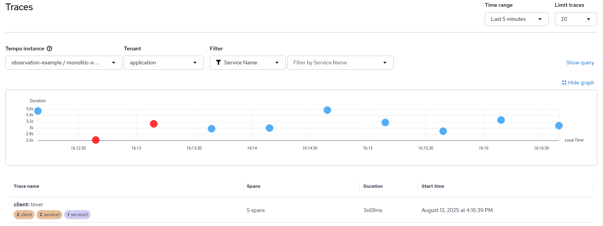
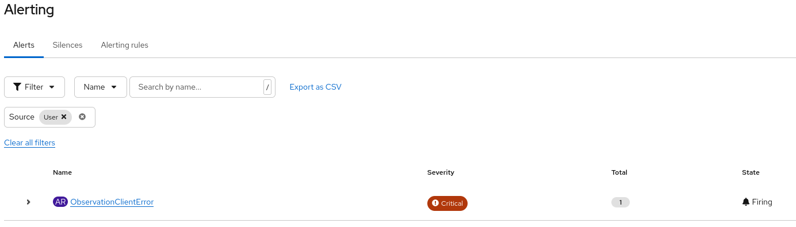

## Requirements

install oc client https://docs.redhat.com/en/documentation/openshift_container_platform/latest/html/cli_tools/openshift-cli-oc#cli-getting-started[docs]

prepare monitor stack on OCP https://docs.redhat.com/en/documentation/openshift_container_platform/latest/html-single/monitoring/index#preparing-to-configure-the-monitoring-stack[docs]

check if user project monitoring is enabled https://docs.redhat.com/en/documentation/openshift_container_platform/latest/html-single/monitoring/index#enabling-monitoring-for-user-defined-projects-uwm_preparing-to-configure-the-monitoring-stack-uwm[docs]
----
oc -n openshift-monitoring describe configmap cluster-monitoring-config | grep enableUserWorkload
----
the result should be
----
enableUserWorkload: true
----
granting users permission to configure monitoring for user-defined projects https://docs.redhat.com/en/documentation/openshift_container_platform/latest/html-single/monitoring/index#granting-users-permission-to-monitor-user-defined-projects_preparing-to-configure-the-monitoring-stack-uwm[docs]

install Red Hat build of OpenTelemetry https://docs.redhat.com/en/documentation/openshift_container_platform/latest/html/red_hat_build_of_opentelemetry/install-otel#installing-otel-by-using-the-web-console_install-otel[doc]

install Tempo Operator https://docs.redhat.com/en/documentation/openshift_container_platform/latest/html/distributed_tracing/distr-tracing-tempo-installing#distr-tracing-tempo-install-web-console_distr-tracing-tempo-installing[doc]

install Cluster Observability Operator https://docs.redhat.com/en/documentation/openshift_container_platform/latest/html/cluster_observability_operator/installing-cluster-observability-operators#installing-the-cluster-observability-operator-in-the-web-console-_installing_the_cluster_observability_operator[doc]

## Deploy the application
----
oc new-project observation-example
----
create all the managed resources
----
oc apply -f ocp/tempo.yaml
oc apply -f ocp/otel-roles.yaml
oc apply -f ocp/otel-collector.yaml
oc apply -f ocp/ui-plugin.yaml
----
build the application and deploy the services in the namespace
----
mvn clean package -Popenshift
----

add targets for metrics

----
oc apply -f ocp/service-monitor.yaml
----

configuring example alert https://docs.openshift.com/container-platform/latest/monitoring/managing-alerts.html#creating-alerting-rules-for-user-defined-projects_managing-alerts[docs]

----
oc apply -f ocp/alert-rule.yaml
----

## Observe data

### Distributed tracing using Jaeger

To see traces go to the `Observe -> Traces` menu item in the console at:
----
echo "$(oc whoami --show-console)/observe/traces/"
----
Select `Tempo instance` with the one we are using (`observation-example/monolitic-example`) and all the traces should be shown

If you want to filter only errors filter by `Status` selecting `error`

### Inspect collected Metrics with OCP integrated UI

To see collected metrics, connect to the console at:
----
echo "$(oc whoami --show-console)/monitoring/query-browser"
----
or navigate manually to `Observe -> Metrics` in the web console menu

you can fill the query field to show data and graph, for example:

----
#show the number of the exchanges for an application (service1)
camel_exchanges_total{job="otel-example-collector",exported_job="service1",eventType="route"}

#show the number of the failed exchanges
camel_exchanges_failed_total{job="otel-example-collector",exported_job="service1",eventType="route"}

#how many routes are running for each Camel context
sum(camel_routes_running{service="otel-example-collector-headless"}) by (camelContext)
----

moreover the alert example is fired if an error is faced within the latest 30 seconds
----
echo "$(oc whoami --show-console)/monitoring/alerts?rowFilter-alert-source=user"
----
or navigate manually to `Observe -> Alerting` in the web console menu, filtering results by `Source=User`

Once fired the alert will be visible

