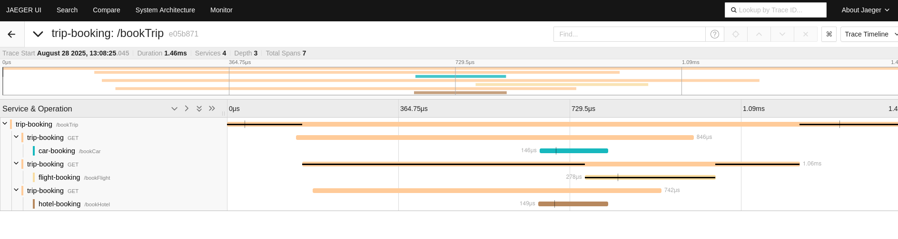
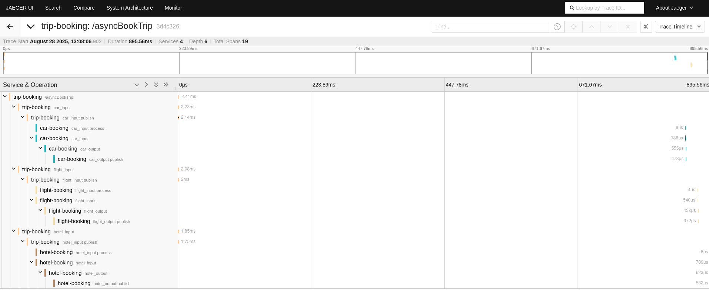
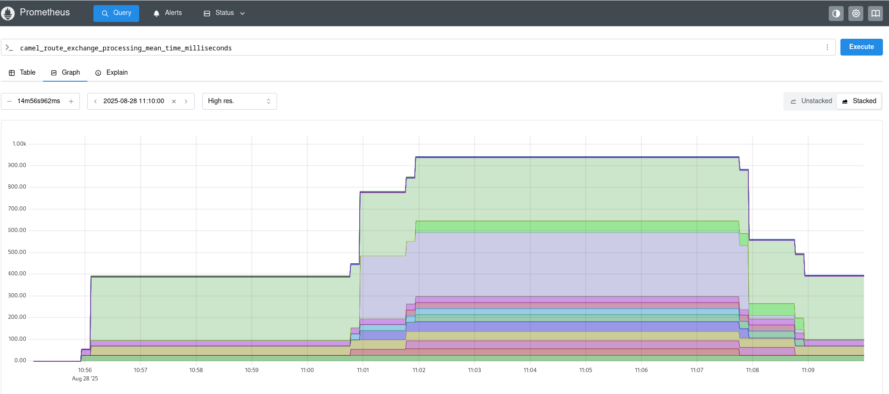

== OpenTelemetry - Spring Boot example

=== Abstract

This example shows how to use Camel with OpenTelemetry standard.

== Introduction

image:./adoc/img/example.jpeg?raw=true[example]

The environment is the following:

* Demo apps:
** link:trip-booking[Trip booking app]
** link:flight-booking[Flight booking app]
** link:hotel-booking[Hotel booking app]
** link:car-booking[Car booking app]
* OpenTelemetry Collector
* Jaeger
* Prometheus
* Apache Kafka _(for async communication between apps cases)_

=== Build

You will need to compile this example first:

[source,sh]
----
mvn compile
----

All the following docker-compose commands should be run from this directory.

=== Run the example

You may want to remove any old containers to start cleaning:

[source,sh]
----
docker rm -f kafka zookeeper prometheus jaeger otel-collector
----

We suggest using multiple terminal windows to start the following components:

* Infrastructure components
* Demo apps
** TripBooking
** FlightBooking
** HotelBooking
** CarBooking
* Testing for sending HTTP requests

==== Startup infrastructure components

[source,sh]
----
docker-compose -f containers/docker-compose.yml up
----

==== Startup demo apps
Please use four different shells for each application:

===== CarBooking
[source,sh]
----
mvn clean spring-boot:run -f car-booking/pom.xml
----

===== HotelBooking
[source,sh]
----
mvn clean spring-boot:run -f hotel-booking/pom.xml
----

===== FlightBooking
[source,sh]
----
mvn clean spring-boot:run -f flight-booking/pom.xml
----

===== TripBooking
[source,sh]
----
mvn clean spring-boot:run -f trip-booking/pom.xml
----

==== Testing

You can use any HTTP client (web browser, curl, httpie, postman etc.) for testing purposes.

===== cURL

Sync communication (over HTTP):

[source,sh]
----
curl http://127.0.0.1:8080/camel/bookTrip
----

Async communication (over Kafka):

[source,sh]
----
curl http://127.0.0.1:8080/camel/asyncBookTrip
----

==== Links

* Prometheus UI: http://localhost:9090/graph
* Jaeger UI: http://localhost:16686

=== Outcome
==== Tracing
===== Sync case
You should get a trace view similar to this one:



DAG is the following:

image::adoc/img/trace-sync-dag.png[]

===== Async case
You should get a trace view similar to this one:



DAG is the following:

image::adoc/img/trace-async-dag.png[]

==== Metrics

You will get Camel-related metrics similar to these:



==== Logging

MDC Logging is enabled, and tracing information printing into the logs to be able to find corresponding trace logs entries. For example:

[source,sh]
----
...
11:52:18.923 INFO  [d02a363f16e88d9f012a36563b5464f5,9a328d33319645ab] bookTrip-http - New book trip request with trace=00-d02a363f16e88d9f012a36563b5464f5-9570717e10d38afa-01
11:52:18.931 INFO  [d02a363f16e88d9f012a36563b5464f5,9a328d33319645ab] bookTrip-http - Response: [{"bookingId":82,"car":"Volkswagen Jetta","startDate":"12-11-2018","endDate":"15-11-2018","price":152}, {"bookingId":907,"flight":"China Eastern Airlines 2782","startDate":"12-11-2018","endDate":"15-11-2018","price":133}, {"bookingId":926,"hotel":"Sheraton","startDate":"12-11-2018","endDate":"15-11-2018","price":200}]
...
----

=== Install example on OpenShift

==== Requirements

- `oc` client installed (https://docs.openshift.com/container-platform/latest/cli_reference/openshift_cli/getting-started-cli.html[guide])
- already logged in into cluster (running `oc login`)
- destination project already created (running `oc new-project otel-example`)

==== Install operators

 - Red Hat Streams for Apache Kafka https://docs.redhat.com/en/documentation/red_hat_streams_for_apache_kafka/latest/html/deploying_and_managing_streams_for_apache_kafka_on_openshift/deploying-streams-from-operator-hub-str[doc]
 - Red Hat build of OpenTelemetry https://docs.redhat.com/en/documentation/openshift_container_platform/latest/html/red_hat_build_of_opentelemetry/install-otel#installing-otel-by-using-the-web-console_install-otel[doc]
 - Tempo Operator https://docs.redhat.com/en/documentation/openshift_container_platform/latest/html/distributed_tracing/distr-tracing-tempo-installing#distr-tracing-tempo-install-web-console_distr-tracing-tempo-installing[doc]
- Cluster Observability Operator https://docs.redhat.com/en/documentation/openshift_container_platform/latest/html/cluster_observability_operator/installing-cluster-observability-operators#installing-the-cluster-observability-operator-in-the-web-console-_installing_the_cluster_observability_operator[doc]

==== Create resources

Create kafka cluster named `otel-cluster`:

```
cat << EOF | oc apply -f -
apiVersion: kafka.strimzi.io/v1beta2
kind: KafkaNodePool
metadata:
  name: multirole
  labels:
    strimzi.io/cluster: otel-cluster
spec:
  roles:
    - controller
    - broker
  storage:
    type: ephemeral
    kraftMetadata: shared
  replicas: 1
---
apiVersion: kafka.strimzi.io/v1beta2
kind: Kafka
metadata:
  name: otel-cluster
  annotations:
    strimzi.io/kraft: enabled
    strimzi.io/node-pools: enabled
spec:
  kafka:
    logging:
      type: inline
    config:
      offsets.topic.replication.factor: 1
      transaction.state.log.replication.factor: 1
      default.replication.factor: 1
      min.insync.replicas: 1
      transaction.state.log.min.isr: 1
    listeners:
      - name: plain
        port: 9092
        type: internal
        tls: false
      - name: tls
        port: 9093
        type: internal
        tls: true
    version: 3.9.0
EOF
```

Create tempo monolithic named `monolitic-example` as distributed tracing storage:

```
cat << EOF | oc apply -f -
apiVersion: tempo.grafana.com/v1alpha1
kind: TempoMonolithic
metadata:
  name: monolitic-example
spec:
  multitenancy:
    authentication:
      - tenantId: application
        tenantName: application
    enabled: true
    mode: openshift
  tenants:
    mode: openshift
    authentication:
      - tenantId: application
        tenantName: application
  resources:
    limits:
      cpu: '2'
      memory: 2Gi
  storage:
    traces:
      backend: memory
EOF
```

Create roles to send traces via Collector, to the Tempo

```
cat << EOF | oc apply -f -
apiVersion: rbac.authorization.k8s.io/v1
kind: ClusterRole
metadata:
  name: tempo-traces-reader
rules:
  - apiGroups:
      - 'tempo.grafana.com'
    resources:
      - application
    resourceNames:
      - traces
    verbs:
      - 'get'
---
apiVersion: rbac.authorization.k8s.io/v1
kind: ClusterRoleBinding
metadata:
  name: tempo-traces-reader
roleRef:
  apiGroup: rbac.authorization.k8s.io
  kind: ClusterRole
  name: tempo-traces-reader
subjects:
  - kind: Group
    apiGroup: rbac.authorization.k8s.io
    name: system:authenticated
---
apiVersion: rbac.authorization.k8s.io/v1
kind: ClusterRole
metadata:
  name: tempo-traces-write
rules:
  - apiGroups:
      - 'tempo.grafana.com'
    resources:
      - application
    resourceNames:
      - traces
    verbs:
      - 'create'
---
kind: ServiceAccount
apiVersion: v1
metadata:
  name: otel-collector
---
kind: ClusterRoleBinding
apiVersion: rbac.authorization.k8s.io/v1
metadata:
  name: tempo-traces-from-otel
subjects:
  - kind: ServiceAccount
    name: otel-collector
    namespace: otel-example
roleRef:
  apiGroup: rbac.authorization.k8s.io
  kind: ClusterRole
  name: tempo-traces-write
EOF
```

Create opentelemetry collector named `otel-example` used to collect everything coming from the agent on the applications and exporting the traces into the tempo storage and the metrics in a prometheus format:

```
cat << EOF | oc apply -f -
kind: OpenTelemetryCollector
apiVersion: opentelemetry.io/v1beta1
metadata:
  name: otel-example
spec:
  serviceAccount: otel-collector
  config:
    extensions:
      bearertokenauth:
        filename: /var/run/secrets/kubernetes.io/serviceaccount/token
    exporters:
      debug: {}
      otlp/tempo:
        auth:
          authenticator: bearertokenauth
        endpoint: 'tempo-monolitic-example-gateway:4317'
        headers:
          X-Scope-OrgID: application
        tls:
          insecure_skip_verify: true
      prometheus:
        endpoint: '0.0.0.0:8889'
        metric_expiration: 180m
    processors:
      batch:
        send_batch_size: 1000
        timeout: 10s
    receivers:
      otlp:
        protocols:
          grpc: {}
          http: {}
    service:
      extensions:
        - bearertokenauth
      pipelines:
        traces:
          exporters:
            - debug
            - otlp/tempo
          processors:
            - batch
          receivers:
            - otlp
        metrics:
          exporters:
            - debug
            - prometheus
          processors:
            - batch
          receivers:
            - otlp
  replicas: 1
  ports:
    - name: promexporter
      port: 8889
      protocol: TCP
      targetPort: 8889
EOF
```

Create the opentelementry instrumentation to allow to inject the agent parameter into the startup command in the application

```
cat << EOF | oc apply -f -
apiVersion: opentelemetry.io/v1alpha1
kind: Instrumentation
metadata:
  name: camel-instrumentation
spec:
  exporter:
    endpoint: 'http://otel-example-collector-headless:4318'
  java:
    image: 'ghcr.io/open-telemetry/opentelemetry-operator/autoinstrumentation-java:2.5.0'
    env:
      - name: OTEL_SERVICE_NAME
        valueFrom:
          fieldRef:
            fieldPath: 'metadata.labels[''app'']'
      - name: OTEL_TRACER_SAMPLER
        value: always_on
      - name: OTEL_LOGS_EXPORTER
        value: none
EOF
```

Install the distributed tracing UI plugin to show the traces on the OCP console https://docs.redhat.com/en/documentation/openshift_container_platform/latest/html/cluster_observability_operator/observability-ui-plugins#coo-distributed-tracing-ui-plugin-install_distributed-tracing-ui-plugin[doc]

```
cat << EOF | oc apply -f -
apiVersion: observability.openshift.io/v1alpha1
kind: UIPlugin
metadata:
  name: distributed-tracing
spec:
  type: DistributedTracing
EOF
```

Create the service monitor to allow the prometheus metrics exposed by the opentelemetry collector be scraped by the OpenShift metrics storage

```
cat << EOF | oc apply -f -
apiVersion: monitoring.coreos.com/v1
kind: ServiceMonitor
metadata:
  name: otel-example-collector
spec:
  endpoints:
    - interval: 30s
      port: promexporter
      scheme: http
      path: /metrics
  selector:
    matchLabels:
      app.kubernetes.io/name:  otel-example-collector
EOF
```

==== Deploy applications

```
mvn clean install -Popenshift -DskipTests
```

now once the pods are ready it is possible to call the Trip Booking entry point

Sync communication (over HTTP):

```
curl http://$(oc get route trip-booking -o go-template --template='{{.spec.host}}')/camel/bookTrip
```

Async communication (over Kafka):

```
curl http://$(oc get route trip-booking -o go-template --template='{{.spec.host}}')/camel/asyncBookTrip
```

The Distributed Tracing console is available on the OpenShift console in the `Observe -> Traces` item

```
echo $(oc whoami --show-console)/observe/traces
```

To query the metrics it is possible to use the integrated OpenShift monitoring console in the `Observe -> Metrics` item

```
echo $(oc whoami --show-console)/monitoring/query-browser
```

a query like
```
sum(camel_exchanges_total{service="otel-example-collector-headless"}) by(exported_job, routeId)
```
will show you the exchanges for each route on each application

==== Undeploy applications

```
mvn oc:undeploy -Popenshift
```

=== Help and contributions

If you hit any problem using Camel or have some feedback, then please
https://camel.apache.org/community/support/[let us know].

We also love contributors, so
https://camel.apache.org/community/contributing/[get involved] :-)

The Camel riders!
