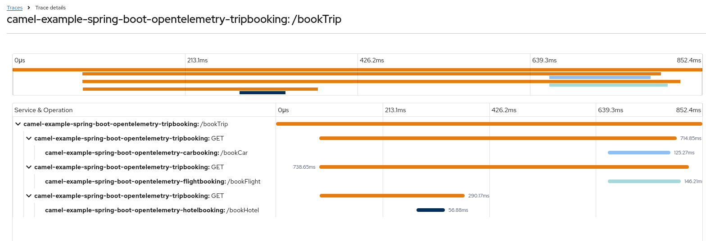
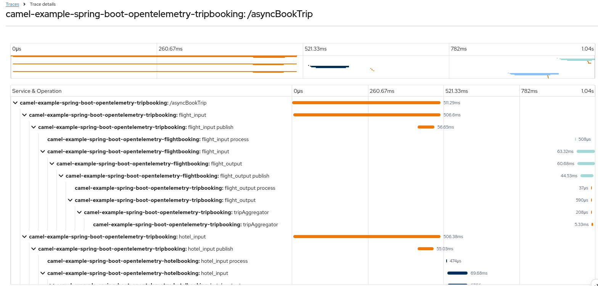
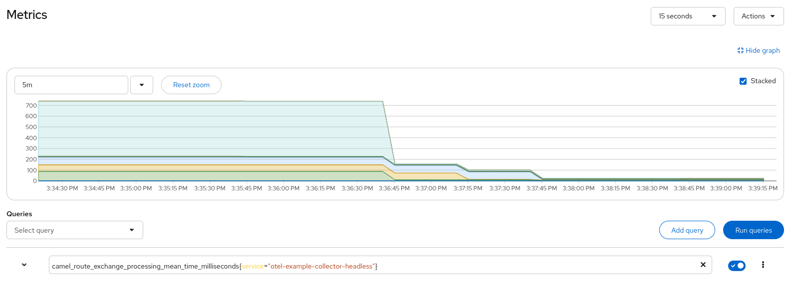

== OpenTelemetry - Spring Boot example

=== Abstract

This example shows how to use Camel with OpenTelemetry standard.

== Introduction

image:./adoc/img/example.jpeg?raw=true[example]

The environment is the following:

* Demo apps:
** link:trip-booking[Trip booking app]
** link:flight-booking[Flight booking app]
** link:hotel-booking[Hotel booking app]
** link:car-booking[Car booking app]
* OpenTelemetry Collector
* Jaeger
* Prometheus
* Apache Kafka _(for async communication between apps cases)_

=== Build

You will need to compile this example first:

[source,sh]
----
mvn compile
----

All the following docker-compose commands should be run from this directory.

=== Run the example

You may want to remove any old containers to start cleaning:

[source,sh]
----
docker rm -f kafka zookeeper prometheus jaeger otel-collector
----

We suggest using multiple terminal windows to start the following components:

* Infrastructure components
* Demo apps
** TripBooking
** FlightBooking
** HotelBooking
** CarBooking
* Testing for sending HTTP requests

==== Startup infrastructure components

[source,sh]
----
docker-compose -f containers/docker-compose.yml up
----

==== Startup demo apps
Please use four different shells for each application:

===== CarBooking
[source,sh]
----
mvn clean spring-boot:run -f car-booking/pom.xml
----

===== HotelBooking
[source,sh]
----
mvn clean spring-boot:run -f hotel-booking/pom.xml
----

===== FlightBooking
[source,sh]
----
mvn clean spring-boot:run -f flight-booking/pom.xml
----

===== TripBooking
[source,sh]
----
mvn clean spring-boot:run -f trip-booking/pom.xml
----

==== Testing

You can use any HTTP client (web browser, curl, httpie, postman etc.) for testing purposes.

===== cURL

Sync communication (over HTTP):

[source,sh]
----
curl http://127.0.0.1:8080/camel/bookTrip
----

Async communication (over Kafka):

[source,sh]
----
curl http://127.0.0.1:8080/camel/asyncBookTrip
----

==== Links

* Prometheus UI: http://localhost:9090/graph
* Jaeger UI: http://localhost:16686

=== Outcome
==== Tracing
===== Sync case
You should get a trace view similar to this one:

image::adoc/img/trace-sync.png[]

===== Async case
You should get a trace view similar to this one:

image::adoc/img/trace-async.png[]

==== Metrics

You will get Camel-related metrics similar to these:

image::adoc/img/metrics.png[]

==== Logging

MDC Logging is enabled, and tracing information printing into the logs to be able to find corresponding trace logs entries. For example:

[source,sh]
----
...
11:52:18.923 INFO  [d02a363f16e88d9f012a36563b5464f5,9a328d33319645ab] bookTrip-http - New book trip request with trace=00-d02a363f16e88d9f012a36563b5464f5-9570717e10d38afa-01
11:52:18.931 INFO  [d02a363f16e88d9f012a36563b5464f5,9a328d33319645ab] bookTrip-http - Response: [{"bookingId":82,"car":"Volkswagen Jetta","startDate":"12-11-2018","endDate":"15-11-2018","price":152}, {"bookingId":907,"flight":"China Eastern Airlines 2782","startDate":"12-11-2018","endDate":"15-11-2018","price":133}, {"bookingId":926,"hotel":"Sheraton","startDate":"12-11-2018","endDate":"15-11-2018","price":200}]
...
----

=== Install example on OpenShift

==== Requirements

- `oc` client installed (https://docs.openshift.com/container-platform/latest/cli_reference/openshift_cli/getting-started-cli.html[guide])
- already logged in into cluster (running `oc login`)
- destination project already created (running `oc new-project otel-example`)

==== Install operators

 - Red Hat Streams for Apache Kafka https://docs.redhat.com/en/documentation/red_hat_streams_for_apache_kafka/latest/html/deploying_and_managing_streams_for_apache_kafka_on_openshift/deploying-streams-from-operator-hub-str[doc]
 - Red Hat build of OpenTelemetry https://docs.redhat.com/en/documentation/openshift_container_platform/latest/html/red_hat_build_of_opentelemetry/install-otel#installing-otel-by-using-the-web-console_install-otel[doc]
 - Tempo Operator https://docs.redhat.com/en/documentation/openshift_container_platform/latest/html/distributed_tracing/distr-tracing-tempo-installing#distr-tracing-tempo-install-web-console_distr-tracing-tempo-installing[doc]
- Cluster Observability Operator https://docs.redhat.com/en/documentation/openshift_container_platform/latest/html/cluster_observability_operator/installing-cluster-observability-operators#installing-the-cluster-observability-operator-in-the-web-console-_installing_the_cluster_observability_operator[doc]

==== Create resources

Create kafka cluster named `otel-cluster`:

[source,sh]
----
oc apply -f ocp/kafka.yaml
----

Create tempo monolithic named `monolitic-example` as distributed tracing storage:

[source,sh]
----
oc apply -f ocp/tempo.yaml
----

Create roles to send traces via Collector, to the Tempo

[source,sh]
----
oc apply -f ocp/roles.yaml
----

Create opentelemetry collector named `otel-example` used to collect everything coming from the agent on the applications and exporting the traces into the tempo storage and the metrics in a prometheus format:

[source,sh]
----
oc apply -f ocp/otel-collector.yaml
----

Create the opentelementry instrumentation to allow to inject the agent parameter into the startup command in the application

[source,sh]
----
oc apply -f ocp/otel-instrumentation.yaml
----

Install the distributed tracing UI plugin to show the traces on the OCP console https://docs.redhat.com/en/documentation/openshift_container_platform/latest/html/cluster_observability_operator/observability-ui-plugins#coo-distributed-tracing-ui-plugin-install_distributed-tracing-ui-plugin[doc]

[source,sh]
----
oc apply -f ocp/ui-plugin.yaml
----

Create the service monitor to allow the prometheus metrics exposed by the opentelemetry collector be scraped by the OpenShift metrics storage

[source,sh]
----
oc apply -f ocp/service-monitor.yaml
----

==== Deploy applications

```
mvn clean install -Popenshift -DskipTests
```

now once the pods are ready it is possible to call the Trip Booking entry point

Sync communication (over HTTP):

```
curl http://$(oc get route trip-booking -o go-template --template='{{.spec.host}}')/camel/bookTrip
```

Async communication (over Kafka):

```
curl http://$(oc get route trip-booking -o go-template --template='{{.spec.host}}')/camel/asyncBookTrip
```

The Distributed Tracing console is available on the OpenShift console in the `Observe -> Traces` item

```
echo $(oc whoami --show-console)/observe/traces
```

===== Sync case



===== Async case



To query the metrics it is possible to use the integrated OpenShift monitoring console in the `Observe -> Metrics` item

```
echo $(oc whoami --show-console)/monitoring/query-browser
```

a query like
```
sum(camel_route_exchange_completed_total{service="otel-example-collector-headless"}) by(exported_job)
```

to see the total exchanges for each service or just the mean time for each route
```
camel_route_exchange_processing_mean_time_milliseconds{service="otel-example-collector-headless"}
```
will show you the exchanges for each route on each application



All the metrics for Camel JMX rules are available at https://github.com/open-telemetry/opentelemetry-java-instrumentation/blob/main/instrumentation/jmx-metrics/javaagent/camel.md[Camel Metrics]

==== Undeploy applications

run this command for each application

```
mvn oc:undeploy -Popenshift
```

=== Help and contributions

If you hit any problem using Camel or have some feedback, then please
https://camel.apache.org/community/support/[let us know].

We also love contributors, so
https://camel.apache.org/community/contributing/[get involved] :-)

The Camel riders!
