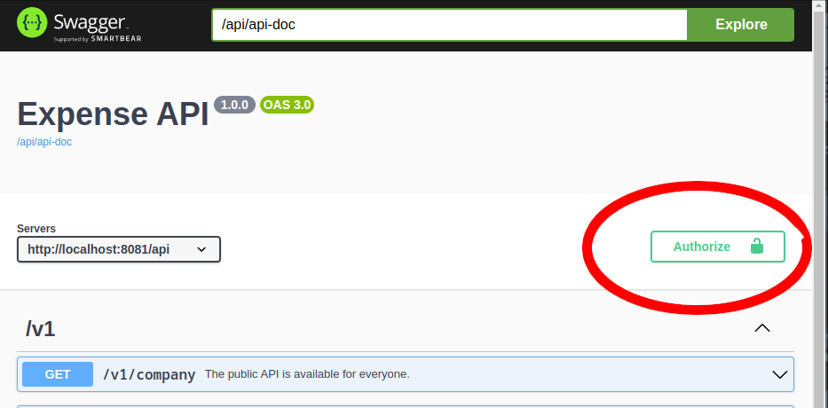
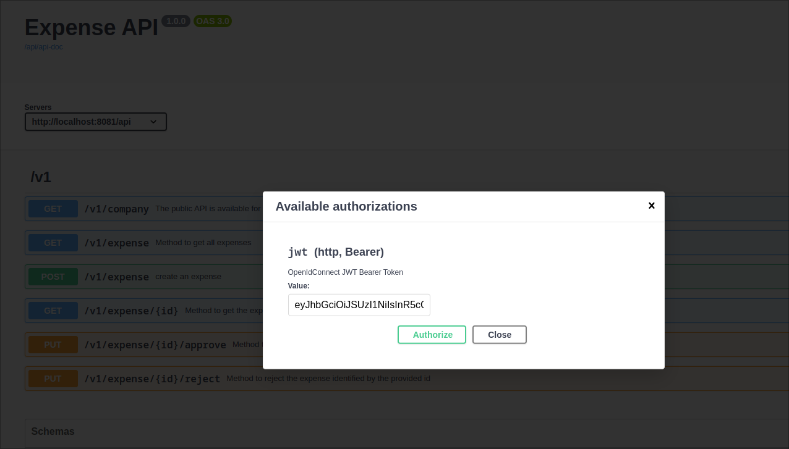

= Camel REST DSL + Spring Security + OpenID Connect + JWT Authorization Example

:autofit-option:

=== Abstract

This example demonstrates how to configure an Apache Camel application that uses *camel-spring-security* for route authorization and integrates with *OpenID Connect (OIDC)* for authentication using *JWT tokens*.

== Features

- *Authentication*: OpenID Connect (OIDC) with Keycloak identity provider.
- *Authorization*: Spring Security with role-based access control for Camel routes.
- *JWT Support*: Decode and validate JWT tokens in the application.
- *Route Protection*: Restrict access to specific Camel routes based on user roles.

== Prerequisites

1. *Java 17+*
2. *Keycloak OIDC Identity Provider* (but, with some modifications, you can use another OIDC Identity Provider e.g. Okta, Auth0, etc.)
3. *Maven* for building the project

== Setup

=== 1. Identity Provider Configuration

- Set up a client in your OIDC provider (e.g., Keycloak, Okta).
- Configure the following settings:
    - *Client ID*: `expenses-api`
    - *Client Secret*: `<your-client-secret>`
    - *Allowed Scopes*: `openid`, `profile`, `roles`
- Enable JWT token generation and ensure roles are included in the token.

- Alternatively you can import the realm configuration file link:src/test/resources/keycloak/expense-realm.json[expense-realm.json]. The resulting realm after importing the configuration
contains the following users:


|===
| Name                             | Username  | Password         | Realm Role |  Client Role

| Alejandro Garnacho Ferreyra      | agarnacho | ManchesterUnited | manager    | supervisor
| James Burns Wesley               | wjburns   | Ipswich          | employee   | consultant
| Richard Rios Montoya             | rrios     | Palmeiras        | manager    | supervisor
| Ronald Federico Araújo da Silva  | rfaraujo  | Barcelona        | employee   | consultant
|===

and the following client:

|===
|Client id    | Client secret
|expenses-api | YIQvHh3ny8T7thPu3HKgJXX3VvEhlxY6
|===


=== Run locally on Docker

Is possible to run the entire project with keycloak pre-configured using docker maven plugin.
In order to do it, you need to have a running docker daemon on your machine, then in a shell
you can run:

[source,console]
----
mvn clean package docker:build  docker:start docker:watch -Ddocker.watchMode=run docker:stop  -P docker
----

Get the access token (change the username and password is needed):

[source,console]
----
TOKEN=$(curl -d 'client_id=expenses-api' -d 'client_secret=YIQvHh3ny8T7thPu3HKgJXX3VvEhlxY6' -d 'username=agarnacho' -d 'password=ManchesterUnited' -d 'grant_type=password' 'http://localhost:8080/realms/expenses/protocol/openid-connect/token' | jq -r '.access_token')
----

and use it in the requests:

[source,console]
----
curl -H 'Accept: application/json' -H "Authorization: Bearer ${TOKEN}" http://localhost:8081/api/v1/expense
----

=== Run on Openshift

Openshift deployment and running can be done through "openshift profile". It requires additional resources to be installed first at namespace level.

==== Create namespace

```
oc new-project oauth-security-test
```

==== Install a Postgres database

```
oc create sa postgres-sa

cat <<EOF | oc apply -f -
apiVersion: apps/v1
kind: StatefulSet
metadata:
  name: postgresql-db
spec:
  serviceName: postgresql-db-service
  selector:
    matchLabels:
      app: postgresql-db
  replicas: 1
  template:
    metadata:
      labels:
        app: postgresql-db
    spec:
      containers:
        - name: postgresql-db
          image: postgres:15
          volumeMounts:
            - mountPath: /data
              name: cache-volume
          env:
            - name: POSTGRES_USER
              value: admin
            - name: POSTGRES_PASSWORD
              value: admin
            - name: PGDATA
              value: /data/pgdata
            - name: POSTGRES_DB
              value: keycloak
      serviceAccount: postgres-sa
EOF

cat <<EOF | oc apply -f -
apiVersion: v1
kind: Service
metadata:
  name: postgres-db
spec:
  selector:
    app: postgresql-db
  type: LoadBalancer
  ports:
  - port: 5432
    targetPort: 5432
EOF
```

==== Install CertManager Operator

After installing CertManager from related operator, let create
issuer using the CA, use to generate required keycloak certificates
```
cat <<EOF | oc apply -f -
apiVersion: cert-manager.io/v1
kind: Issuer
metadata:
  name: self-signer
  namespace: oauth-security-test
  labels:
    app.kubernetes.io/instance: cert-issuer
spec:
  selfSigned: {}
EOF
```

create Keycloak keystore password

```
oc create secret generic kc-keystore-secret -n oauth-security-test --from-literal=password=changeme
```

generate Keycloak certificate, note that the commonName and dnsNames depends on the service generated by the Keycloak operator, plus the route as is supposed to bee based on the cluster domain

```
cat <<EOF | oc apply -f -
apiVersion: cert-manager.io/v1
kind: Certificate
metadata:
  name: keycloak
  namespace: oauth-security-test
spec:
  isCA: false
  subject:
    organizations:
      - oauth-security-test
  keystores:
    jks:
      create: true
      passwordSecretRef:
        key: password
        name: kc-keystore-secret
  usages:
    - server auth
  commonName: keycloak-service
  issuerRef:
    group: cert-manager.io
    kind: Issuer
    name: self-signer
  secretName: keycloak-tls
  dnsNames:
    - keycloak-service
    - keycloak-service.oauth-security-test.svc.cluster.local
    - keycloak-oauth-security-test.apps.example.openshift.com
EOF
```

==== Install Keycloak Operator

Once Keycloak is installed and keycloak-operator-* pod is running anfd ready create Keycloak database credentials

```
oc create secret generic keycloak-db-credentials --from-literal=username=admin --from-literal=password=admin
```

And finally the Keycloak instance:

```
cat <<EOF | oc apply -f -
apiVersion: k8s.keycloak.org/v2alpha1
kind: Keycloak
metadata:
  labels:
    app: keycloak
    app.kubernetes.io/instance: keycloak
  name: keycloak
  namespace: oauth-security-test
spec:
  db:
    database: keycloak
    host: keycloak-db-postgres
    passwordSecret:
      key: password
      name: keycloak-db-credentials
    port: 5432
    usernameSecret:
      key: username
      name: keycloak-db-credentials
  hostname:
    hostname: keycloak-oauth-security-test.apps.example.openshift.com
    strict: false
    strictBackchannel: true
  http:
    httpEnabled: true
    tlsSecret: keycloak-tls
  image: 'keycloak/keycloak:26.1.2'
  instances: 1
  startOptimized: false
  unsupported:
    podTemplate:
      spec:
        containers:
          - env:
              - name: KC_BOOTSTRAP_ADMIN_USERNAME
                value: admin
              - name: KC_BOOTSTRAP_ADMIN_PASSWORD
                value: admin
              - name: KC_HTTP_PORT
                value: '8080'
              - name: KC_HTTPS_PORT
                value: '8443'
              - name: KC_HOSTNAME_STRICT_HTTPS
                value: 'false'
              - name: KC_TLS_HOSTNAME_VERIFIER
                value: ANY
              - name: KC_PROXY
                value: passthrough
              - name: KC_HEALTH_ENABLED
                value: 'true'
EOF
```

In this file we are supposing `keycloak-oauth-security-test.apps.example.openshift.com` is the route hostname on the cluster.

To run camel spring boot application:

[source,console]
----
mvn clean package -Popenshift
----

At this point we need to upload the realm through Keycloak API.
First, let retrieve the "admin" access token to perform this operation:

[source,console]
----
TOKEN=$(curl -d 'client_id=admin-cli' -d 'username=admin' -d 'password=admin' -d 'grant_type=password' 'http://keycloak-oauth-security-test.apps.example.openshift.com/realms/master/protocol/openid-connect/token' | jq -r '.access_token')
----

And let call the realm uploader API:

[source,console]
----
curl -X POST http://keycloak-oauth-security-test.apps.example.openshift.com/admin/realms -H 'Accept: application/json' -H "Authorization: Bearer ${TOKEN}" --data "@src/test/resources/keycloak/expense-realm.json"
----

Now, we can use the users API to query the expenses realm after getting the "user" access token (change the username and password is needed):

[source,console]
----
TOKEN=$(curl -d 'client_id=expenses-api' -d 'client_secret=YIQvHh3ny8T7thPu3HKgJXX3VvEhlxY6' -d 'username=agarnacho' -d 'password=ManchesterUnited' -d 'grant_type=password' 'http://keycloak-oauth-security-test.apps.example.openshift.com/realms/expenses/protocol/openid-connect/token' | jq -r '.access_token')
----

and use it in the CSB requests, where `csb-rest-spring-security-smongiar.apps.example.openshift.com` is the route of CSB deployed application on Openshift:
:

[source,console]
----
curl -H 'Accept: application/json' -H "Authorization: Bearer ${TOKEN}" http://csb-rest-spring-security-smongiar.apps.example.openshift.com/api/v1/expense
----


==== Use the Swagger UI (Locally)

There is an embedded Swagger UI provided by springdoc available at link:http://localhost:8081/openapi/swagger-ui/index.html[http://localhost:8081/openapi/swagger-ui/index.html]

image::doc/img/swagger-ui.png[]

For the protected methods, you have to get the JWT token, click on Authorize button




and paste the token on the input text box of the dialog:




=== Help and contributions

If you hit any problem using Camel or have some feedback, then please
https://camel.apache.org/support.html[let us know].

We also love contributors, so
https://camel.apache.org/contributing.html[get involved] :-)

The Camel riders!
